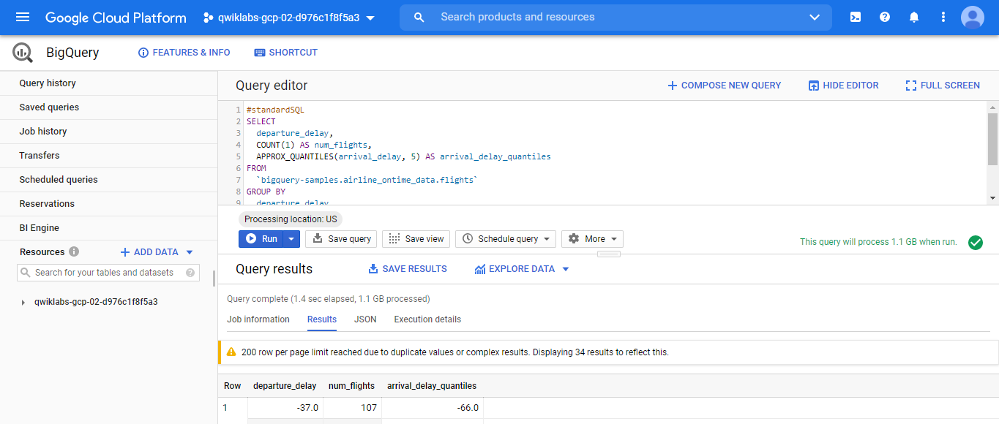
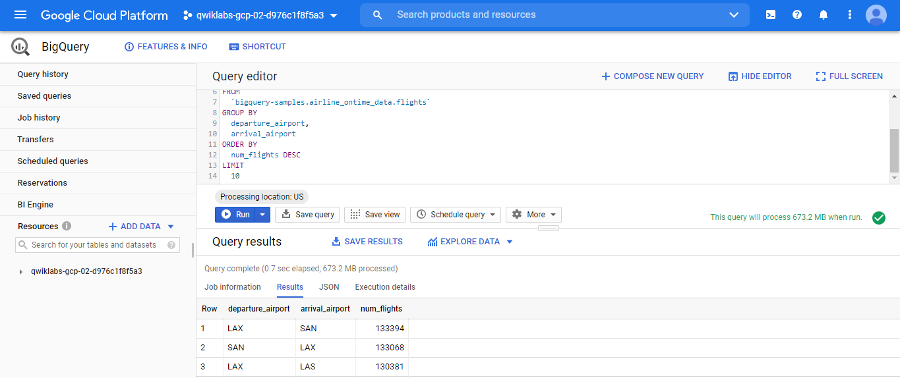
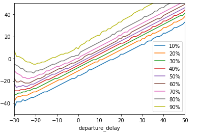

# How Google does Machine Learning

[source](https://googlecoursera.qwiklabs.com/focuses/12009710?parent=lti_session)

## Lab1: Renting a VM to Process Earthquake Data

### Task 1. Create Compute Engine instance with the necessary API access

**SSH into the instance**

cat /proc/cpuinfo

### Task 2. Install software

sudo apt-get update

sudo apt-get -y -qq install git

sudo apt-get install python-mpltoolkits.basemap

git --version

### Task 3. Ingest USGS data
https://github.com/GoogleCloudPlatform/datalab-samples/blob/master/basemap/earthquakes.ipynb

git clone https://github.com/GoogleCloudPlatform/training-data-analyst

cd training-data-analyst/CPB100/lab2b

less ingest.sh

bash ingest.sh

### Task 4. Transform the data

earthquacke data source: http://earthquake.usgs.gov/earthquakes/feed/v1.0/summary/all_week.csv
other: https://www.usgs.gov/natural-hazards/earthquake-hazards/data-tools

notebook: https://github.com/GoogleCloudPlatform/datalab-samples/blob/master/basemap/earthquakes.ipynb

bash install_missing.sh

python3 transform.py

ls -l

### Task 5. Create a Cloud Storage bucket and Store data

new bucket: qwiklabs-gcp-04-93b7fe1a24b6

**Store data**

gsutil cp earthquakes.* gs://qwiklabs-gcp-04-93b7fe1a24b6/earthquakes/

**Publish Cloud Storage files to the web**

Same for earthquackes.png
* Authenticated URL: https://storage.cloud.google.com/qwiklabs-gcp-04-93b7fe1a24b6/earthquakes/earthquakes.png
*(Public URL: https://storage.googleapis.com/qwiklabs-gcp-04-93b7fe1a24b6/earthquakes/earthquakes.png)

exit

***

## Lab2: Analyzing data using AI Platform Notebooks and BigQuery

** Step 1**

#standardSQL
SELECT
  departure_delay,
  COUNT(1) AS num_flights,
  APPROX_QUANTILES(arrival_delay, 5) AS arrival_delay_quantiles
FROM
  `bigquery-samples.airline_ontime_data.flights`
GROUP BY
  departure_delay
HAVING
  num_flights > 100
ORDER BY
  departure_delay ASC

*Question**: What is the median arrival delay for flights left 35 minutes early?

(**Answer**: the typical flight that left 35 minutes early arrived 28 minutes early.)  

** Step 2**

#standardSQL
SELECT
  departure_airport,
  arrival_airport,
  COUNT(1) AS num_flights
FROM
  `bigquery-samples.airline_ontime_data.flights`
GROUP BY
  departure_airport,
  arrival_airport
ORDER BY
  num_flights DESC
LIMIT
  10

  

### Draw graphs in AI Platform Notebooks

** Step 4**

!pip install google-cloud-bigquery==1.25.0

** Step 5**

query="""
SELECT
  departure_delay,
  COUNT(1) AS num_flights,
  APPROX_QUANTILES(arrival_delay, 10) AS arrival_delay_deciles
FROM
  `bigquery-samples.airline_ontime_data.flights`
GROUP BY
  departure_delay
HAVING
  num_flights > 100
ORDER BY
  departure_delay ASC
"""

from google.cloud import bigquery
df = bigquery.Client().query(query).to_dataframe()
df.head()

** Step 6**

import pandas as pd
percentiles = df['arrival_delay_deciles'].apply(pd.Series)
percentiles = percentiles.rename(columns = lambda x : str(x*10) + "%")
df = pd.concat([df['departure_delay'], percentiles], axis=1)
df.head()

** Step 7**

without_extremes = df.drop(['0%', '100%'], 1)
without_extremes.plot(x='departure_delay', xlim=(-30,50), ylim=(-50,50));

