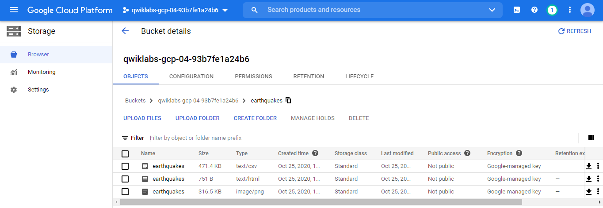
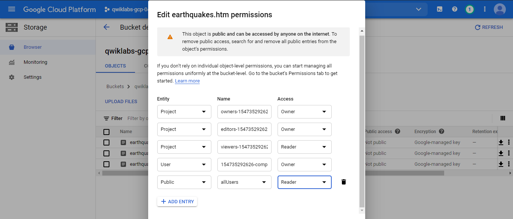
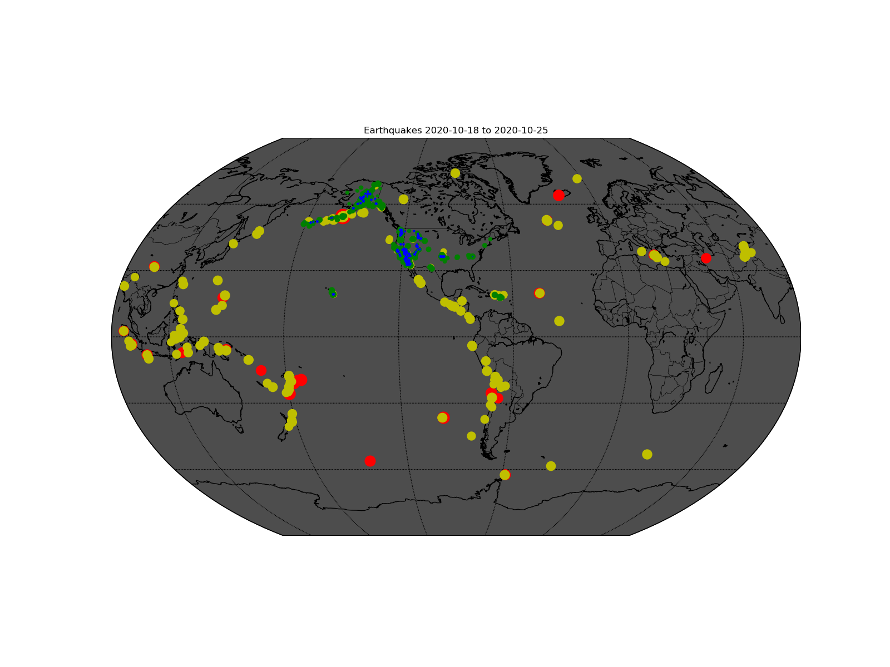
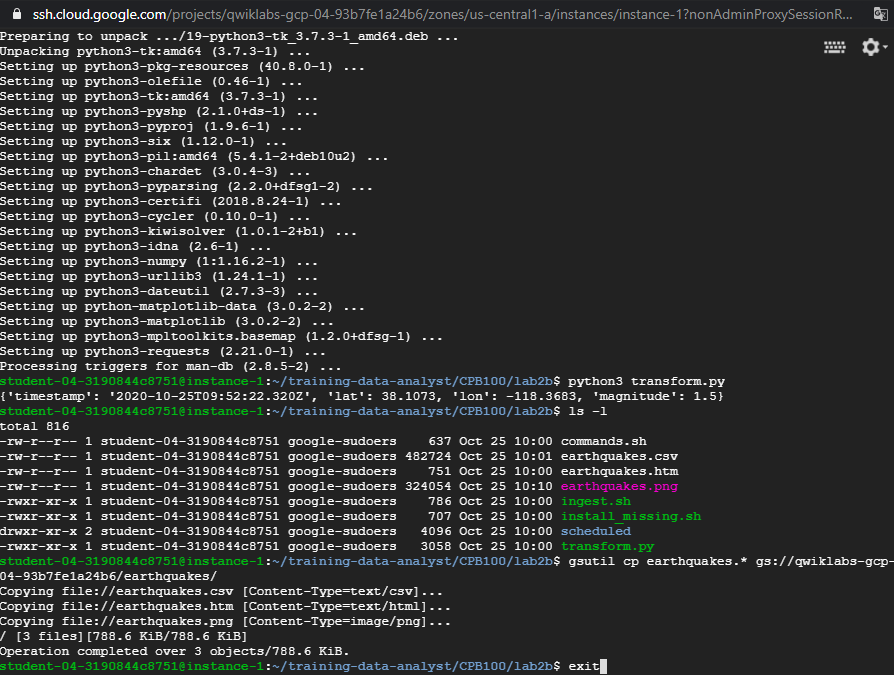

## Lab1: Renting a VM to Process Earthquake Data

### Task 1. Create Compute Engine instance with the necessary API access

**SSH into the instance**

cat /proc/cpuinfo

### Task 2. Install software

sudo apt-get update

sudo apt-get -y -qq install git

sudo apt-get install python-mpltoolkits.basemap

git --version

### Task 3. Ingest USGS data
https://github.com/GoogleCloudPlatform/datalab-samples/blob/master/basemap/earthquakes.ipynb

git clone https://github.com/GoogleCloudPlatform/training-data-analyst

cd training-data-analyst/CPB100/lab2b

less ingest.sh

bash ingest.sh

### Task 4. Transform the data

earthquacke data source: http://earthquake.usgs.gov/earthquakes/feed/v1.0/summary/all_week.csv
other: https://www.usgs.gov/natural-hazards/earthquake-hazards/data-tools

notebook: https://github.com/GoogleCloudPlatform/datalab-samples/blob/master/basemap/earthquakes.ipynb

bash install_missing.sh

python3 transform.py

ls -l

### Task 5. Create a Cloud Storage bucket and Store data

new bucket: qwiklabs-gcp-04-93b7fe1a24b6

**Store data**

gsutil cp earthquakes.* gs://qwiklabs-gcp-04-93b7fe1a24b6/earthquakes/

**Publish Cloud Storage files to the web**

Same for earthquackes.png
* Authenticated URL: https://storage.cloud.google.com/qwiklabs-gcp-04-93b7fe1a24b6/earthquakes/earthquakes.png
*(Public URL: https://storage.googleapis.com/qwiklabs-gcp-04-93b7fe1a24b6/earthquakes/earthquakes.png)

exit

